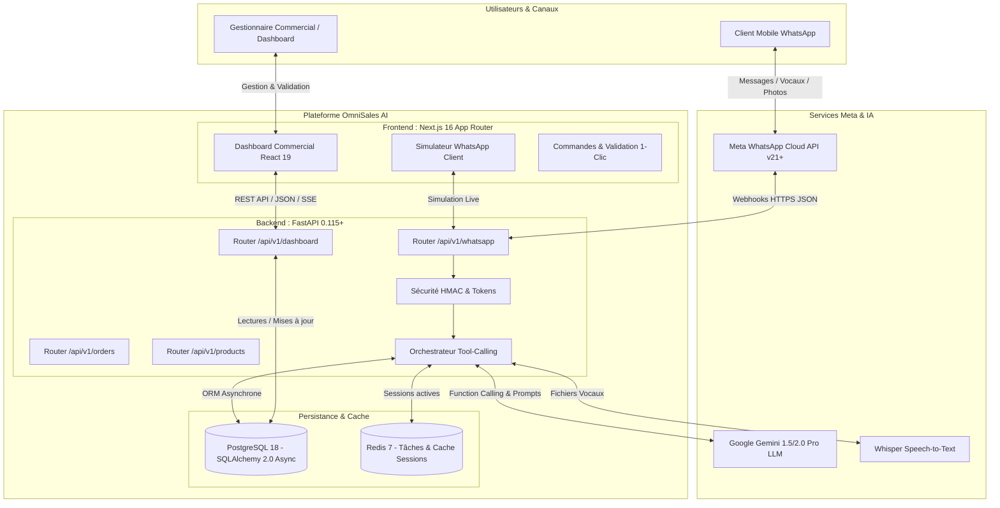

# 📋 CAHIER DES CHARGES FONCTIONNEL ET TECHNIQUE (CDCF)
# Projet : WhatsApp AI Commerce Copilot & Order Hub
### *Plateforme SaaS d'Automatisation Commerciale par IA Multimodale (FastAPI & Next.js 16)*

---

## Fiche d'Identité du Projet

| Paramètre | Valeur / Description |
| :--- | :--- |
| **Nom du Projet** | WhatsApp AI Commerce Copilot (`omnisales-ai`) |
| **Porteur du Projet** | Kevin |
| **Cible Clientèle** | PME, Grossistes, Distributeurs, E-commerçants B2B & B2C |
| **Architecture Logicielle** | Architecture Découplée Moderne (API REST / WebSocket Backend + SPA/SSR Frontend) |
| **Stack Backend** | **FastAPI 0.115+** (Python 3.12+, AsyncIO, Pydantic v2, SQLAlchemy 2.0 Async, Alembic) |
| **Stack Frontend** | **Next.js 16** (React 19, App Router, TypeScript, Tailwind CSS, Shadcn UI, Lucide Icons) |
| **Base de Données** | **PostgreSQL 18** (ACID transactionnel, indexation JSONB & Full-Text Search) |
| **Canal Utilisateur** | WhatsApp Business (Meta Cloud API v21+) |
| **Moteur d'IA** | LLM Multimodal avec Function Calling (**Google Gemini 1.5/2.0 Pro / Flash**) + Whisper Audio STT |
| **Statut du Document** | Version 2.0 — Transition Architecture Moderne Découplée (Next.js & FastAPI) |
| **Date** | Septembre 2026 |

---

## Sommaire

1. [Contexte et Enjeux Métier](#1-contexte-et-enjeux-métier)
2. [Objectifs Stratégiques et Indicateurs de Performance (KPIs)](#2-objectifs-stratégiques-et-indicateurs-de-performance-kpis)
3. [Périmètre du Projet (In-Scope / Out-of-Scope)](#3-périmètre-du-projet-in-scope--out-of-scope)
4. [Spécifications Fonctionnelles Détaillées](#4-spécifications-fonctionnelles-détaillées)
5. [Architecture Technique et Flux de Données](#5-architecture-technique-et-flux-de-données)
6. [Exigences Non-Fonctionnelles (Sécurité, Performance, Robustesse)](#6-exigences-non-fonctionnelles)
7. [Modèle de Données et Schéma Relationnel](#7-modèle-de-données-et-schéma-relationnel)
8. [Gouvernance, Rôles et Matrice RACI](#8-gouvernance-rôles-et-matrice-raci)
9. [Planning Prévisionnel de Réalisation (Jalons)](#9-planning-prévisionnel-de-réalisation-jalons)
10. [Estimation Budgétaire et Coûts d'Exploitation (TCO)](#10-estimation-budgétaire-et-coûts-dexploitation-tco)
11. [Approbation et Signatures](#11-approbation-et-signatures)

---

## 1. Contexte et Enjeux Métier

### 1.1. Le Constat du Marché
Dans la majorité des marchés émergents et chez un nombre croissant de commerces modernes, **plus de 85% des commandes et demandes de prix s'effectuent sur WhatsApp**.
Les clients n'utilisent plus les tunnels de vente traditionnels ni les formulaires de contact complexes. Ils envoient des messages spontanés, souvent sous forme de **notes vocales** ou de **photos** :
* *"Salut ! Il vous reste 15 cartons de carreaux 60x60 et 3 sacs de colle ?"*
* *"Je veux recommander la même chose que la semaine passée, faites-moi le total."*
* *(Photo d'une pièce mécanique ou d'un meuble)* : *"Vous avez ce modèle en stock ?"*

### 1.2. La Problématique des Entreprises
La gestion manuelle de ce canal WhatsApp engendre des pertes colossales :
* **Temps de latence fatal** : Un client attendant plus de 10 minutes se tourne vers un concurrent.
* **Perte d'informations & commandes oubliées** : Les échanges se perdent dans des téléphones d'employés sans synchronisation centrale.
* **Erreurs de chiffrage & stocks fantômes** : Devis émis sur des articles déjà épuisés en magasin.
* **Lenteur de validation financière** : Faux reçus de virements ou de Mobile Money acceptés par manque d'outils de traçabilité.

### 1.3. La Solution : Stack Moderne FastAPI + Next.js 16
Pour surmonter les lourdeurs des ERP monolithiques traditionnels, le projet adopte une **architecture moderne, légère et ultra-rapide** :
1. **Un Backend FastAPI asynchrone haute performance** : Dédié au traitement instantané des Webhooks Meta, à l'orchestration multimodale (audio, vision, texte) et à l'exécution déterministe d'outils (*Tool Calling*).
2. **Un Frontend Next.js 16 (App Router / React 19)** : Un Cockpit commercial temps réel, fluide, responsive, permettant aux équipes de vente de superviser les conversations, valider les commandes en 1 clic (*Human-in-the-Loop*) et gérer les stocks avec une expérience utilisateur (UX) digne des meilleurs standards SaaS mondiaux.

---

## 2. Objectifs Stratégiques et Indicateurs de Performance (KPIs)

### 2.1. Objectifs Stratégiques
* **Vente instantanée 24/7** : Accusé de réception et traitement des demandes en moins de 3 secondes, 24h/24.
* **Expérience utilisateur supérieure** : Tableau de bord web Next.js 16 ultra-réactif avec mise à jour en temps réel (SSE / WebSockets).
* **Fiabilité & Sécurité financière** : L'IA prépare les commandes (devis chiffrés), mais la confirmation finale et le déclenchement de livraison demeurent sous le contrôle absolu d'un opérateur humain.

### 2.2. Indicateurs Clés de Performance (KPIs Mesurables)

| Indicateur (KPI) | Situation Manuelle | Cible avec FastAPI + Next.js 16 |
| :--- | :--- | :--- |
| **Temps de première réponse client** | 30 min à 4 heures | **< 3 secondes** |
| **Temps de génération d'un devis chiffré** | 10 à 15 minutes | **< 5 secondes (automatique)** |
| **Latence d'affichage du Dashboard** | Plusieurs secondes (rechargements lourds) | **< 100 ms (Next.js Server Components & Cache)** |
| **Disponibilité du service commercial** | 8h - 18h (jours ouvrés) | **24h/24, 7j/7 sans coupure** |
| **Taux d'erreur sur les prix & stocks** | ~10% | **0% (contrôlé par la base PostgreSQL)** |

---

## 3. Périmètre du Projet (In-Scope / Out-of-Scope)

### 3.1. Périmètre Inclus (In-Scope)
* **Passerelle WhatsApp Meta Cloud API (Graph API v21+)** :
  * Réception et émission des messages textes, notes vocales et images.
  * Validation stricte des signatures cryptographiques HMAC SHA-256.
* **Backend FastAPI 0.115+ (Python 3.12+)** :
  * Architecture REST API complète & endpoints Webhook asynchrones.
  * Orchestrateur d'IA avec *Function Calling* (Google Gemini 1.5/2.0 Pro & Flash).
  * Service de transcription audio (Whisper API / Faster-Whisper).
  * Modèles de données relationnels avec SQLAlchemy 2.0 (Async) et Pydantic v2.
* **Frontend Next.js 16 (React 19 / TypeScript)** :
  * **Cockpit Commercial & Supervision** : Tableau de bord des ventes, devis récents, statistiques de conversion.
  * **Simulateur WhatsApp Intégré** : Écran smartphone interactif permettant de simuler et démontrer des parcours clients en direct.
  * **Human-in-the-Loop** : Bouton de confirmation de commande 1-clic et switch de reprise humaine (*Handover*).
  * **Gestionnaire de Catalogue & Stocks** : Visualisation en direct des articles et des quantités disponibles.
* **Base de Données PostgreSQL 18** :
  * Persistance intégrale des clients, conversations, messages, articles et commandes.

### 3.2. Périmètre Exclu (Out-of-Scope v1)
* *Prélèvement bancaire direct autonome sans contrôle* : Le système collecte les justificatifs (reçus Mobile Money/virements) et prévient l'opérateur humain.
* *Appels téléphoniques vocaux synchrones* : Traitement exclusif des messages vocaux WhatsApp enregistrés (pas de VoIP live).

---

## 4. Spécifications Fonctionnelles Détaillées

```
+-----------------------------------------------------------------------------------+
|                     ARCHITECTURE FONCTIONNELLE DU COPILOT                         |
+--------------------------+---------------------------+----------------------------+
| [MOD-01] Moteur Écoute   | [MOD-02] Ventes & Stock   | [MOD-03] Validation Humain |
|  - Webhook FastAPI Meta  |  - Tool Calling Gemini    |  - Dashboard Next.js 16    |
|  - Whisper STT (Audio)   |  - Lecture stocks réels   |  - Validation commande 1-clic|
|  - Vision Gemini (Images)|  - Calcul automatique     |  - Contrôle reçu paiement  |
+--------------------------+---------------------------+----------------------------+
| [MOD-04] Suivi & SAV     | [MOD-05] Cockpit & Handover Administration            |
|  - Suivi d'expédition    |  - Simulateur smartphone WhatsApp intégré              |
|  - Détection réclamation |  - Switch Débrayage Bot <-> Commercial humain         |
|  - Notification client   |  - Métriques CA, taux de conversion, articles phares   |
+--------------------------+--------------------------------------------------------+
```

---

### MOD-01 : Réception & Compréhension Multimodale (FastAPI)
* **SF-1.1 : Réception Webhook Sécurisée**
  * Endpoint FastAPI `POST /api/v1/whatsapp/webhook`.
  * Vérification de la signature cryptographique `X-Hub-Signature-256` via HMAC SHA-256.
  * Endpoint de handshake `GET /api/v1/whatsapp/webhook` validant le `hub.challenge` de Meta.
* **SF-1.2 : Transcription Vocale Asynchrone**
  * Récupération automatique du fichier audio (`.ogg` / Opus) depuis l'API Meta Media.
  * Transcription haute précision en texte français/anglais via Whisper.
* **SF-1.3 : Détection d'Intention & Extraction d'Entités**
  * Le LLM extrait en une seule passe :
    * Intention : `PRIX_STOCK`, `CREATION_COMMANDE`, `SUIVI_COMMANDE`, `RECLAMATION`, `PAIEMENT`.
    * Entités : Produit, Quantité souhaitée, Unité, Adresse de livraison, Identité client.

---

### MOD-02 : Moteur Commercial & Gestion des Commandes
* **SF-2.1 : Outils de Consultation Métier (*Function Calling*)**
  * L'IA dispose d'outils typés Python exécutés par FastAPI :
    * `get_product_availability(keyword: str)` : Recherche en base PostgreSQL et renvoie le prix unitaire et le stock exact.
    * `create_draft_order(customer_phone: str, items: list[dict])` : Crée une commande au statut `draft` avec calcul précis des sous-totaux et taxes.
* **SF-2.2 : Gestion des Stocks & Alertes Rupture**
  * Si la quantité demandée dépasse le stock disponible, l'IA propose une quantité ajustée ou un produit équivalent.
* **SF-2.3 : Synthèse de Devis pour le Client**
  * L'IA formate un message WhatsApp élégant :
    > *"Voici votre récapitulatif :*\n*• 3x Ciment Dangote 50kg : 14 700 FCFA*\n*Total : 14 700 FCFA (Livraison en attente de confirmation). Souhaitez-vous confirmer ?"*

---

### MOD-03 : Contrôle Financier & Human-in-the-Loop
* **SF-3.1 : Détection et Archivage de Reçu de Paiement**
  * Analyse de la capture d'écran (Mobile Money Wave, Orange, MTN ou reçu bancaire) par Gemini Vision.
  * Extraction du montant, de la date et de la référence unique de transaction.
  * Blocage automatique des doublons (vérification d'unicité de la référence de transaction).
* **SF-3.2 : Validation Humaine Obligatoire**
  * La commande apparaît immédiatement dans l'interface Next.js en statut **"En Attente de Validation"**.
  * Le responsable commercial clique sur **"Confirmer la Vente"**.
  * **Règle absolue** : L'IA ne peut jamais marquer unilatéralement une commande comme payée ou expédiée.

---

### MOD-04 : Suivi Logistique & SAV
* **SF-4.1 : Notification Proactive**
  * Dès la validation humaine, l'API FastAPI envoie automatiquement un message de confirmation WhatsApp avec le numéro de suivi de la commande.
* **SF-4.2 : Suivi en Libre-Service**
  * Le client peut demander : *"Où en est ma commande ?"*.
  * Le bot répond avec le statut exact : `Préparation`, `Expédiée`, `Livrée`.
* **SF-4.3 : Détection de Litige & Alerte Immédiate**
  * En cas de mécontentement ou de casse signalée, le bot s'excuse poliment, active le mode `handover` (pause bot) et alerte le support sur le dashboard Next.js.

---

### MOD-05 : Cockpit Web Next.js 16 & Débrayage Humain
* **SF-5.1 : Interface Temps Réel (Dashboard & Live Feed)**
  * Visualisation en direct des métriques clés : Chiffre d'Affaires du jour, Nombre de devis générés, Commandes à valider, Alertes stocks faibles.
* **SF-5.2 : Simulateur Client WhatsApp Intégré**
  * Permet de tester et démontrer l'intégralité du tunnel de vente sans dépendre immédiatement d'un compte Meta actif.
* **SF-5.3 : Mode Débrayage (Handover)**
  * Un toggle permet au commercial de désactiver l'IA pour un client spécifique et d'écrire directement via l'interface web.

---

## 5. Architecture Technique et Flux de Données

### 5.1. Schéma d'Architecture Modulaire



---

### 5.2. Pile Technologique Détaillée (Tech Stack Moderne)

| Composant | Technologie Retenue | Rôle et Justification Technique |
| :--- | :--- | :--- |
| **Backend API** | **FastAPI 0.115+ (Python 3.12)** | Asynchronisme natif (ASGI/Uvicorn), validation de données Pydantic v2 ultra-rapide, auto-documentation OpenAPI Swagger interactive. |
| **Frontend Web** | **Next.js 16 (React 19 / TypeScript)** | Performance de premier ordre, Server Components, SSR/SSG, routing dynamique fluide, excellente maintenabilité. |
| **Styling & UI** | **Tailwind CSS v4 + Lucide Icons** | Design système sombre/moderne, réactivité parfaite sur mobile et desktop, zéro dépendance lourde. |
| **Base de Données** | **PostgreSQL 18** | Robustesse relationnelle, intégrité transactionnelle (ACID), requêtes JSONB pour les métadonnées WhatsApp. |
| **ORM / Migration** | **SQLAlchemy 2.0 Async + Alembic** | ORM Python moderne, requêtes asynchrones non-bloquantes, contrôle granulaire des migrations de schéma. |
| **Moteur IA & Vision**| **Google Gemini 1.5/2.0 Pro / Flash** | Excellente latence, capacité multimodale native (audio/images/texte) et support éprouvé du *Function Calling*. |
| **Transcription Vocale**| **OpenAI Whisper API / Faster-Whisper** | Précision inégalée sur les accents francophones et environnementaux. |
| **Conteneurisation** | **Docker & Docker Compose** | Environnement de développement et de déploiement en production reproductible en une seule commande. |

---

## 6. Exigences Non-Fonctionnelles

### 6.1. Sécurité et Protection des Données
1. **Validation Cryptographique des Webhooks** : Toute requête entrante sur `/api/v1/whatsapp/webhook` sans signature `X-Hub-Signature-256` valide est immédiatement rejetée (HTTP 401/403).
2. **Isolation des Clés Secrètes** : Clés API (Google Gemini, Meta WhatsApp Token, secrets de base de données) gérées strictement par variables d'environnement (`.env`) avec validation par Pydantic `BaseSettings`.
3. **Contrôle d'Accès Dashboard** : L'accès au cockpit Next.js est protégé par authentification sécurisée (JWT / Session Cookies sécurisés).

### 6.2. Performance & Vitesse
1. **Accusé de réception Meta < 1 seconde** : FastAPI répond immédiatement `200 OK` à Meta et traite la génération IA en arrière-plan (FastAPI `BackgroundTasks` ou worker asynchrone).
2. **Temps total de réponse IA < 3 secondes** : L'utilisation de modèles Flash et de connexions HTTP persistantes garantit un échange interactif ultra-fluide pour le client.
3. **Chargement du Dashboard Next.js < 300 ms** : Grâce aux Server Components et au cache optimisé de Next.js 16.

---

## 7. Modèle de Données et Schéma Relationnel

Le schéma relationnel PostgreSQL est géré par **SQLAlchemy 2.0 Async** :

```
+-------------------+        +------------------------+        +-------------------+
|     Customer      |        |      Conversation      |        |      Message      |
+-------------------+        +------------------------+        +-------------------+
| id (PK)           |<-------| id (PK)                |<-------| id (PK)           |
| phone_number (UQ) |   1:N  | customer_id (FK)       |   1:N  | conversation_id   |
| name              |        | status (bot/human)     |        | direction (in/out)|
| address           |        | active_order_id (FK)   |        | sender (user/ai/h)|
| created_at        |        | last_activity_at       |        | content           |
+-------------------+        +------------------------+        | media_url         |
        | 1                                                    | created_at        |
        | N                                                    +-------------------+
+-------------------+        +------------------------+
|       Order       |        |       OrderLine        |
+-------------------+        +------------------------+
| id (PK)           |<-------| id (PK)                |
| order_number (UQ) |   1:N  | order_id (FK)          |
| customer_id (FK)  |        | product_id (FK)        |
| status (draft/sale|        | quantity               |
| total_amount      |        | unit_price             |
| receipt_url       |        | subtotal               |
| created_at        |        +------------------------+
+-------------------+
        |
        +-----------------------------> +-------------------+
                                        |      Product      |
                                        +-------------------+
                                        | id (PK)           |
                                        | code (SKU) (UQ)   |
                                        | name              |
                                        | unit_price        |
                                        | stock_quantity    |
                                        | is_active         |
                                        +-------------------+
```

---

## 8. Gouvernance, Rôles et Matrice RACI

| Activité | Client WhatsApp | Agent IA | Commercial / Vendeur | Comptable / Caissier |
| :--- | :---: | :---: | :---: | :---: |
| **Demande de prix & disponibilité** | **R** | **A** | I | I |
| **Création du devis brouillon** | I | **R / A** | C | I |
| **Envoi de la preuve de paiement** | **R** | **C** | I | **A** |
| **Validation finale de la commande** | I | I | **R / A** | C |
| **Expédition & Clôture** | I | **C** (Notification) | **R** | I |
| **Reprise manuelle (SAV / Négociation)**| **R** | I | **R / A** | I |

*(Légende : **R** = Réalise, **A** = Approuve / Responsable final, **C** = Consulté, **I** = Informé)*

---

## 9. Planning Prévisionnel de Réalisation (Jalons)

Le projet s'exécute selon une méthodologie rigoureuse en **4 jalons clairs** :

| Jalon | Titre | Livrables Concrets & Vérifiables |
| :--- | :--- | :--- |
| **Jalon 1 (S1)** | **Architecture & Socle API** | • Structure projet monorepo / backend FastAPI + frontend Next.js 16.<br>• Schéma PostgreSQL & modèles SQLAlchemy.<br>• Endpoints de santé et CRUD de base (Produits, Clients). |
| **Jalon 2 (S2)** | **Moteur IA & Connecteur Meta** | • Webhook FastAPI Meta Cloud API sécurisé.<br>• Orchestration Gemini Function Calling (recherche stock, devis auto).<br>• Module de transcription vocale Whisper. |
| **Jalon 3 (S3)** | **Cockpit Next.js 16 & Temps Réel** | • Dashboard commercial réactif avec KPI en direct.<br>• Simulateur WhatsApp intégré avec chat interactif.<br>• Bouton de validation 1-clic (*Human-in-the-Loop*) et switch Handover. |
| **Jalon 4 (S4)** | **Finitions, Tests & Déploiement** | • Suite de tests automatisés (Pytest côté FastAPI, Vitest côté Next.js).<br>• Docker Compose unifié (FastAPI + Next.js + PostgreSQL).<br>• Documentation Swagger OpenAPI & Guide de déploiement cloud. |

---

## 10. Estimation Budgétaire et Coûts d'Exploitation (TCO)

L'architecture découplée FastAPI + Next.js offre un ratio coût/performance exceptionnel :

* **Hébergement Frontend (Vercel ou VPS Docker)** : **0 €** (Hobby) à **10 € / mois**.
* **Hébergement Backend & Base PostgreSQL (VPS Hetzner / OVH ou Railway)** : **~5 € à 15 € / mois**.
* **Meta WhatsApp Cloud API** : 1 000 conversations de service **gratuites chaque mois**.
* **Moteur IA (Google Gemini Pro / Flash)** : Coût dérisoire grâce aux modèles Flash (~**2 € à 5 € / mois** pour des milliers d'échanges).

> 💡 **Budget total d'exploitation : Moins de 20 € par mois**, tout en offrant une scalabilité capable d'absorber des dizaines de milliers de requêtes quotidiennes.

---

## 11. Approbation et Signatures

Ce document certifie la spécification fonctionnelle et technique du projet **WhatsApp AI Commerce Copilot** sous l'architecture cible **FastAPI + Next.js 16**.

* **Porteur du Projet & Lead Developer** : Kevin  
* **Méthodologie Appliquée** : Disciplined Agentic Software Engineering (Architecture First, TDD, Human-in-the-Loop).
